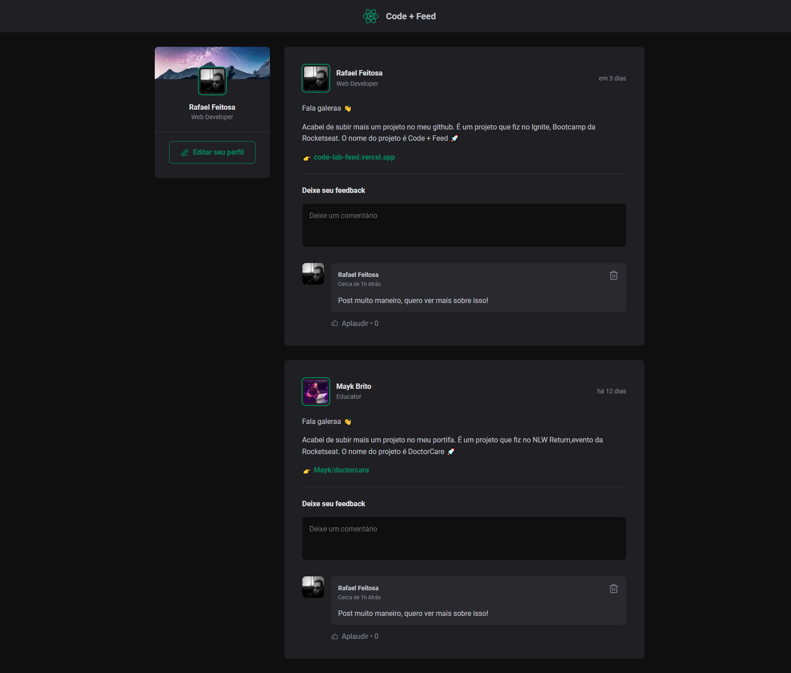
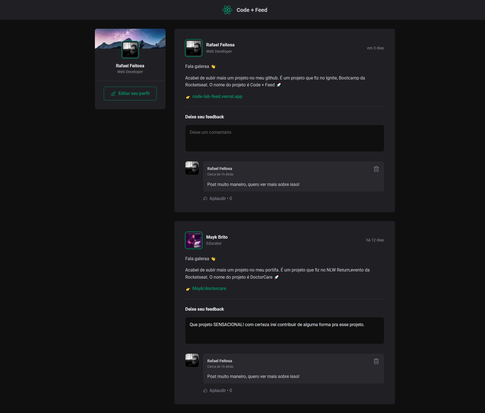

  
  <a href="https://github.com/Rafeso/Ignite-lab/commits/master">
    
  </a>
    
   
   <a href="https://github.com/Rafeso/Ignite-lab/stargazers">
    
  </a>

  <a href="https://www.linkedin.com/in/rafael-feitosa-618472241/">
    
 </a>

<h1 align="center">
    💬 Code Feed 💬
</h1>

<h4 align="center"> 
	✔  Code Feed 🚀 Concluído  ✔
</h4>

<p align="center">
 <a href="#-sobre-o-projeto">Sobre</a> •
 <a href="#-funcionalidades">Funcionalidades</a> •
 <a href="#-layout">Layout</a> • 
 <a href="#-como-executar-o-projeto">Como executar</a> • 
 <a href="#-tecnologias">Tecnologias</a> • 
 <a href="#-autor">Autor</a> • 
 <a href="#user-content--licença">Licença</a>
</p>


## 💻 Sobre o projeto

:notebook_with_decorative_cover: Code Feed


Projeto desenvolvido durante o bootcamp **Ignite** oferecido pela [Rocketseat](https://lp.rocketseat.com.br/ignite).
O Code Feed foi desenvolvido nas aulas introdutórias sobre React e suas funcionalidades como componentes, propriedades, estados, imutabilidade, e hooks, além de aplicar o TypeScript.

---
## ⚙️ Funcionalidades

- [x] Os usuários podem:
  - [x] Criar um novo comentário para um post
  - [x] Apagar comentário
  - [x] "Aplaudir" o comentário quantas vezes quiser

## 🎨 Layout

O layout da aplicação está disponível no Figma:

<a href="https://www.figma.com/file/8gCrarEzdh2iZOlBaec0GX/Ignite-Feed-(Community)?node-id=0%3A1">
  
</a>


### Web

<p align="center" style="display: flex; align-items: flex-start; justify-content: center; gap: 1rem;">
  

  
</p>

<a href="https://code-lab-feed.vercel.app/" align="center">Acesse o site do projeto</a>

---


## 🚀 Como executar o projeto

### Pré-requisitos

Antes de começar, você vai precisar ter instalado em sua máquina as seguintes ferramentas:
[Git](https://git-scm.com), [Node.js](https://nodejs.org/en/).

**Instale a versão LTS do Node.JS** 
 
Além disto é bom ter um editor para trabalhar com o código como [VSCode](https://code.visualstudio.com/)


#### 🧭 Rodando a aplicação web

```bash

# Clone este repositório
$ git clone https://github.com/Rafeso/Ignite-Feed.git

# Acesse a pasta do projeto no seu terminal/cmd
$ cd 01-fundamentos-reactjs-ts

# Instale as dependências
$ npm install

# Execute a aplicação em modo de desenvolvimento
$ npm run dev

# A aplicação será aberta na porta:5173 - acesse http://localhost:5173

```


---

## 🛠 Tecnologias

As seguintes ferramentas foram usadas na construção do projeto:

-   **[Node.js](https://nodejs.org/en/)**
-   **[React](https://pt-br.reactjs.org/)**
-   **[TypeScript](https://www.typescriptlang.org/)**
-  **[CSS](https://www.w3schools.com/css/)**
- **[Phosphor Icons](https://phosphoricons.com/)**

> Veja o arquivo  [package.json](https://github.com/Rafeso/Ignite-Feed/blob/main/package.json)

#### [](https://github.com/Rafeso/ignite-lab#utilit%C3%A1rios)**Utilitários**

-   Protótipo:  **[Figma](https://www.figma.com/)**  →  **[Protótipo (Code Feed)](https://www.figma.com/file/8gCrarEzdh2iZOlBaec0GX/Ignite-Feed-Community?node-id=0%3A1)**
-   Editor:  **[Visual Studio Code](https://code.visualstudio.com/)**  → Extensions:  **[ CSS Modules](https://marketplace.visualstudio.com/items?itemName=bradlc.vscode-tailwindcss)**
-   Markdown:  **[StackEdit](https://stackedit.io/)**
-   Ícones:  **[Phosphor Icons](https://phosphoricons.com/?ref=madewithreactjs.com)**
-   Fontes:  **[Inter](https://fonts.google.com/specimen/Inter)**


---


## 💪 Como contribuir para o projeto

1. Faça um **fork** do projeto.
2. Crie uma nova branch com as suas alterações: `git checkout -b my-feature`
3. Salve as alterações e crie uma mensagem de commit contando o que você fez: `git commit -m "feature: My new feature"`
4. Envie as suas alterações: `git push origin my-feature`
> Caso tenha alguma dúvida confira este [guia de como contribuir no GitHub](https://docs.github.com/pt/get-started/quickstart/contributing-to-projects)

---

## 🦸 Autor

<a href="https://github.com/Rafeso">
 
 <br />
 <sub><b>Rafael Feitosa</b></sub></a> <a href="#">☕</a>
 <br />
 
 [](https://www.linkedin.com/in/rafael-feitosa-618472241/) 
[](https://github.com/Rafeso)

---

## 📝 Licença

Este projeto esta sobe a licença [MIT](./LICENSE).

Feito com ❤️ por Rafael Feitosa 👋🏽 [Entre em contato!](https://www.linkedin.com/in/rafael-feitosa-618472241/)

---